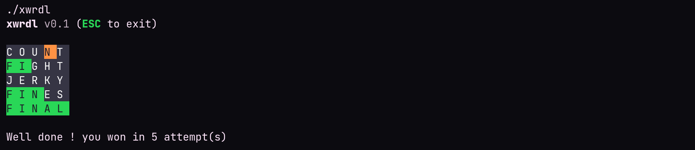

# xwrdl - Wordle, in x86\_64 assembly

> Linux only

This is a pretty shitty wordle in about 400 lines of assembly, thats about it.

## Showcase



## Building

Use the makefile, there is a build target that compiles everything into the xwrdl executable, this doesn't even use the standard library or anything.

## running

either

```bash
make run
```

or build then

```bash
./xwrdl
```
